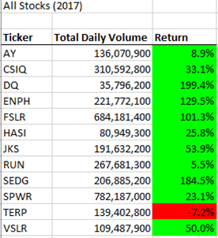
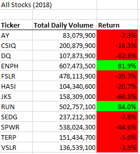

# Stocks Analysis with VBA

## Overview of Project

This project uses VBA to analyze the green energy stocks’ performance to help Steve decide which stocks to invest in. It also requires the data running process to be easier and more user-friendly. Our dataset includes green energy stocks’ daily closing price and the trading volume in 2017 and 2018. The results indicate that in general, the green energy stock market performs well in 2017 and it drops in 2018. After refactoring VBA code, our code runs faster. The execution time is shortened.

## Results

### Results of the stock performance

The total trading volume increases in 2018. Table All Stocks (2017) shows that the green energy stock market performs well in 2017, only one company (Ticker: TERP) gets a negative return. All other listing companies make profit in 2017. DQ which is Steve’s parents favorite, earns 199.4% in 2017. 

Table All Stocks (2018) shows that the market drops in 2018 as most of stocks get negative returns. For DQ, the return lowers 62.6%. 

There are two companies, Ticker ENPH and RUN, make profits in both 2017 and 2018. Our results indicate that these two companies may be a better choice comparing with the company DQ.

### Results of the execution time

By creating a tickerIndex variable and using it to access the tickers, VBA can work on all tickers at the same time after refactoring the code instead of running the ticker analysis one by one. This reduces the running time and make the code more efficient.

The VBA script runs faster after refactoring the code. The execution time for both year 2017 and 2018 is around 0.14 seconds.

## Summary

In general, refactoring code improves the code efficiency and it enables us to expand the dataset. It can use less memory and make the code more user-friendly.

In this VBA practice, the execution time is shortened by refactoring code.
