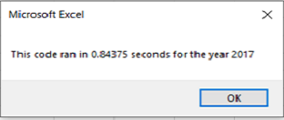
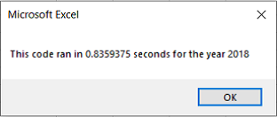
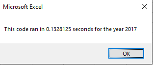
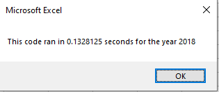

# Stock Analysis with VBA

## Overview of Project

This project uses VBA to analyze the green energy stocks’ performance to help Steve decide which stocks to invest in. It also requires the data running process to be easier and more user-friendly. Our original dataset includes green energy stocks’ daily closing price and the trading volume in 2017 and 2018. The results indicate that in general, the green energy stock market performs well in 2017 and it drops in 2018. After refactoring VBA code, our code runs faster. The execution time is shortened.

## Results

### Results of the stock performance

The total daily trading volume increases in 2018. It indicates that the green stock market is really active. Table All Stocks (2017) shows that the green energy stock market performs well in 2017, and it gets 67.3% return growth in general. Only one company (Ticker: TERP) gets a negative return. All other listing companies make profit in 2017. DQ which is Steve’s parents favorite, earns 199.4% in 2017. 

Table All Stocks (2018) shows that the market drops in 2018 as most of stocks get negative returns. The market return lowers 8.5%. For DQ, the return lowers 62.6%. 

There are two companies, Ticker ENPH and RUN, make profits in both 2017 and 2018. Our results indicate that these two companies may be a better choice comparing with the company DQ.

### Results of the execution time

The project also requires the data running process to be easier and user-friendly. The original code uses the variable i to select the ticker(i) and perform the analysis. By creating a tickerIndex variable and using it to access all tickers, VBA can work on tickers at the same time after refactoring the code. This reduces the running time and make the code more efficient.

The VBA script runs faster after refactoring the code. The execution time for both year 2017 and 2018 is around 0.13 seconds.

- Results before refactoring code

- Results after refactoring code

## Summary

Refactoring code is widely used in computer programming and software design. It has many benefits. It may improve code readability and reduce the execution time. With a few modifications, the script can be used for similar projects or larger datasets. Refactoring code well also use less memory. Even if there are many advantages of doing refactoring code, there are some disadvantages. If done poorly, it may change the script performance and introduce new bugs. Also refactoring codes may require a lot of attention to change few features.

In this VBA practice, both the original and refactored codes can perform the stock analysis well. The original code is easier to understand comparing with the refactored one. However, the execution time is shortened after refactoring code.
